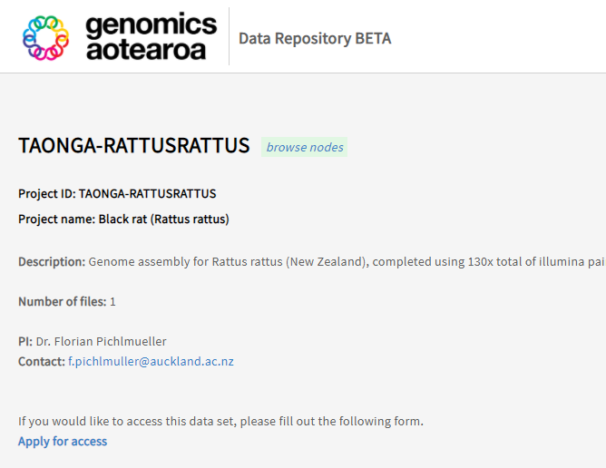

# Requesting access to data

# User access to data

You may find access to the forms from project description pages. Direct links provided below:

- Phormidium project page: https://gen3.data.nesi.org.nz/TAONGA-PHORMIDIUM

- Rattus-rattus project page: https://gen3.data.nesi.org.nz/TAONGA-RATTUSRATTUS

The button to Apply for access is at the bottom links to the access request form, which is located at: https://docs.google.com/forms/u/1/d/e/1FAIpQLScerXN4MLIAgnLfrHbvheMwtM6gtDNaluZ3c_-xEiot2hc6DA/viewform

The form is designed with Google Forms and starts by asking which dataset you are requesting access to (this field is pre-populated if clicked from the project page), followed by a set of questions that will help with Kāhui Māori considerations, and then with the your research project details.

After submitting the form, you will receive an e-mail confirmation. Please answer as much as you can, but if you need assistance with some of the answers, please feel free to contact us at gasupport@nesi.org.nz

Once the form is submitted, NeSI’s GA support team at gasupport@gmail.com (currently Brian Flaherty, Jun Huh, and Dinindu Senanayake) gets the notification of new request and a ticket gets created. The request will be reviewed by Genomics Aotearoa's review panel, and your access will be granted or we will reach out back to you for more information if needed.

[back](index.md)