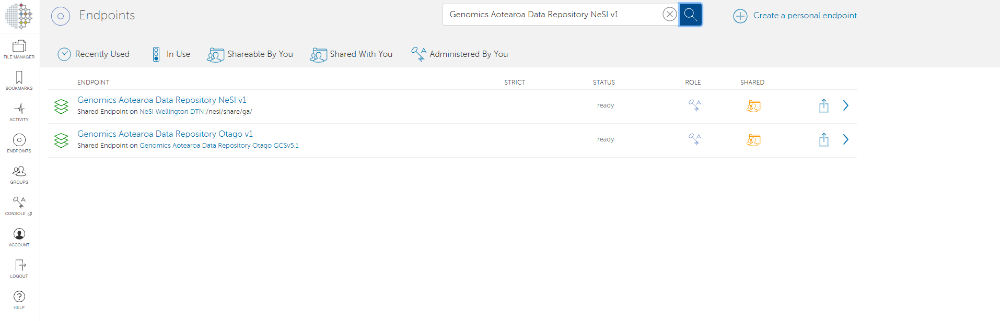
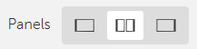
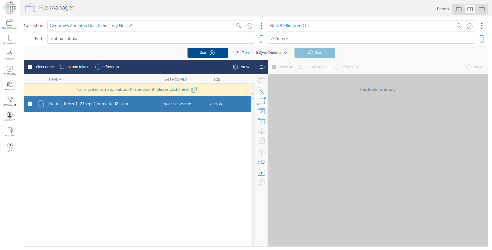
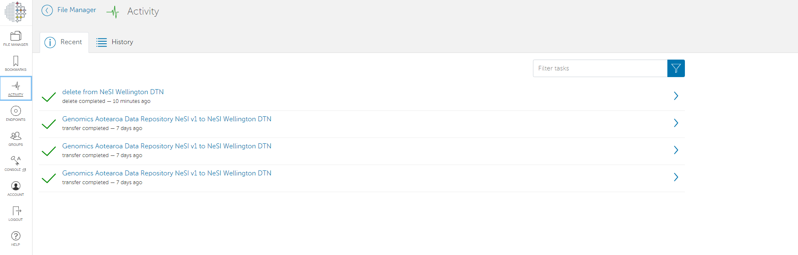

Most of the Aotearoa Genomic Data Repository datasets are currently hosted on NeSI with access via Globus. Once you have been approved for access to a dataset you wish to do research on
(See here: [Requesting access to data](./requesting_access_to_data.md), for how to request access), NeSI's support team will grant you read permission on the data repository Globus endpoint.

## What is Globus?

Globus is a data transfer platform that provides a secure, unified interface to your research data. Globus uses the concept of endpoints to describe shared file locations that are accessible using Globus interface. You may initiate data transfer between any two endpoints that you have permission to. You may log in using your institutional account, Google account, ORCiD, or sign up with a new account on Globus ID.

## How to set up your endpoint

The data repository is accessible on the endpoint Aotearoa Genomic Data Repository NeSI endpoint.

```url
https://transfer.nesi.org.nz/file-manager?origin_id=23d50eab-b3e8-422d-b788-1c43e23eb33e
```

In order to download from above endpoint, you will need a destination endpoint. You may do one of the following:

- Set up a personal endpoint on your machine and transfer into it

    - [Instructions on how to set up a personal endpoint](https://www.globus.org/globus-connect-personal)

- Use your institutional endpoint and transfer into the storage allocated on your institution

- If you wish to use NeSI compute, ask NeSI staff to copy the files into a project folder

    - You can let us know at [gasupport@nesi.org.nz](mailto:gasupport@nesi.org.nz) along with your NeSI project code. We can make the files visible from your project.

## Transfer

1. Once you have set up the destination endpoint, go to [https://transfer.nesi.org.nz/](https://transfer.nesi.org.nz/)
2. Log in
3. Click on Endpoints from the sidebar menu
4. Type in Aotearoa Genomic Data Repository NeSI in the search and select it
    
5. Select 'Open in file manager' and you will be able to see folder contents of datasets you have access to.
6. If you don't see anything, try going to Groups from the sidebar menu. You will see invitations to join groups that will grant you correct access.
7. In the file manager, click on the double panel icon
     and you will see the data repository on one panel, and blank on the other.
8. On the blank panel, select the destination endpoint you have access to, which may be your personal endpoint or your institutional endpoint.
9. Navigate to locations for transfer source and destination on both panels
10. Select folders and files that you wish to transfer, and then click Start.
    

    !!! tip
        Use standard conventions for file and folder naming (without space, comma and any non-alphanumerical character)
11. Once the transfer is initiated, it will happen in the background automatically. You may check on its status by clicking on Activity on the sidebar.
    
