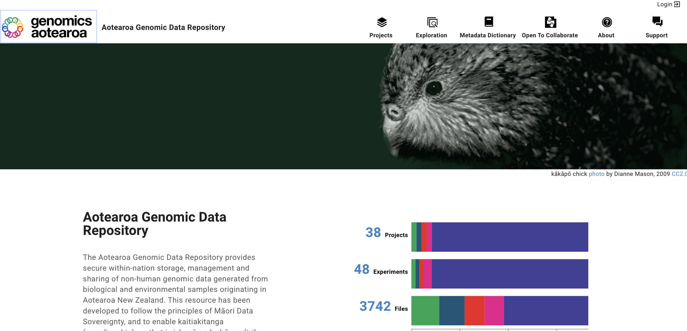
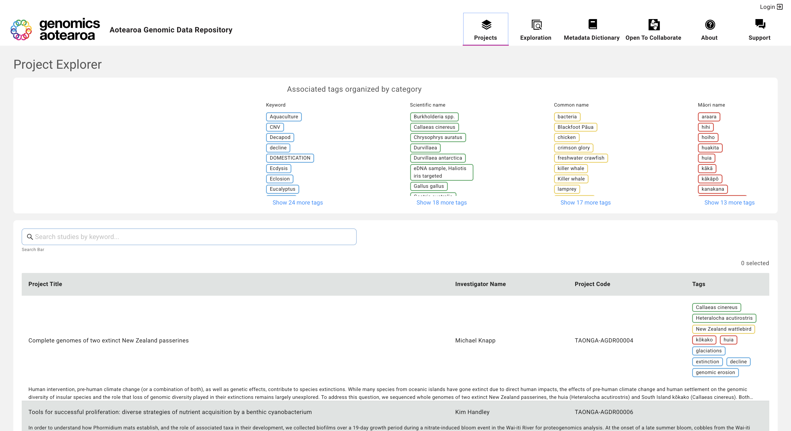
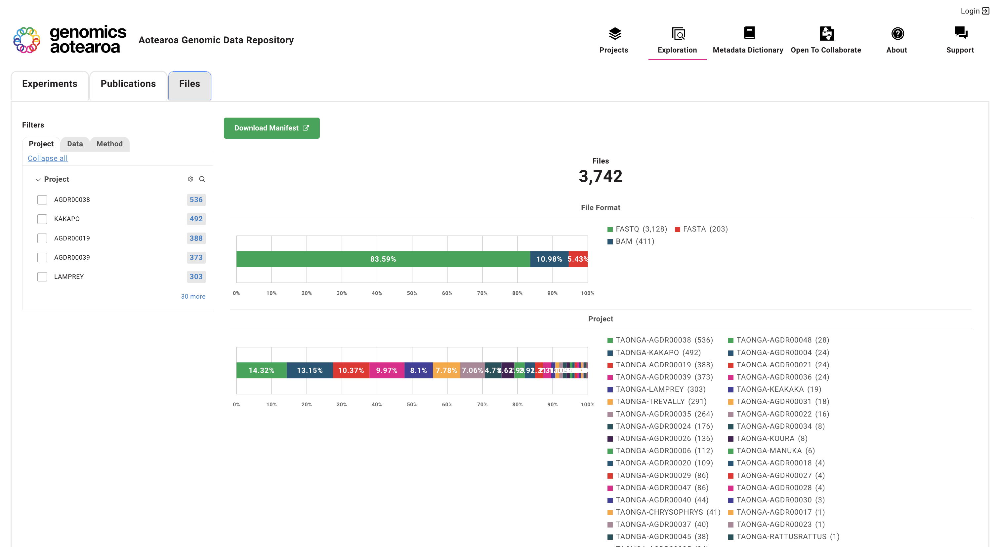
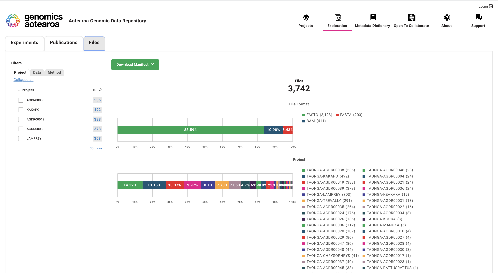
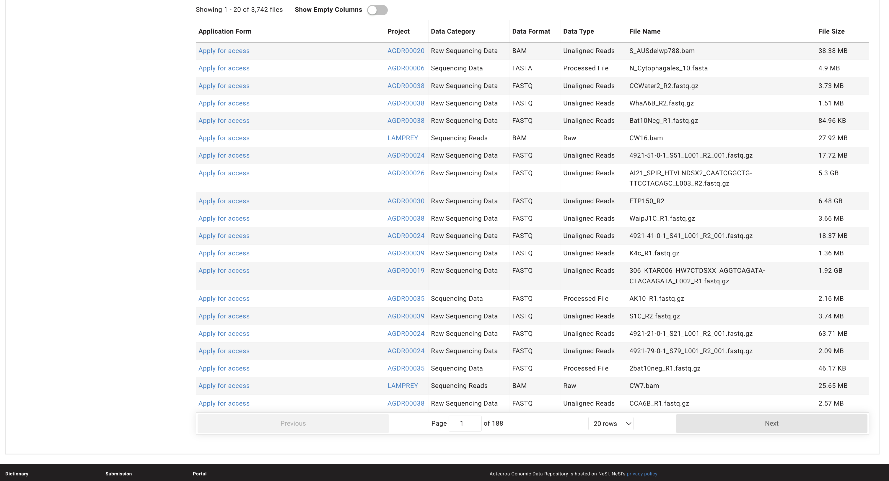
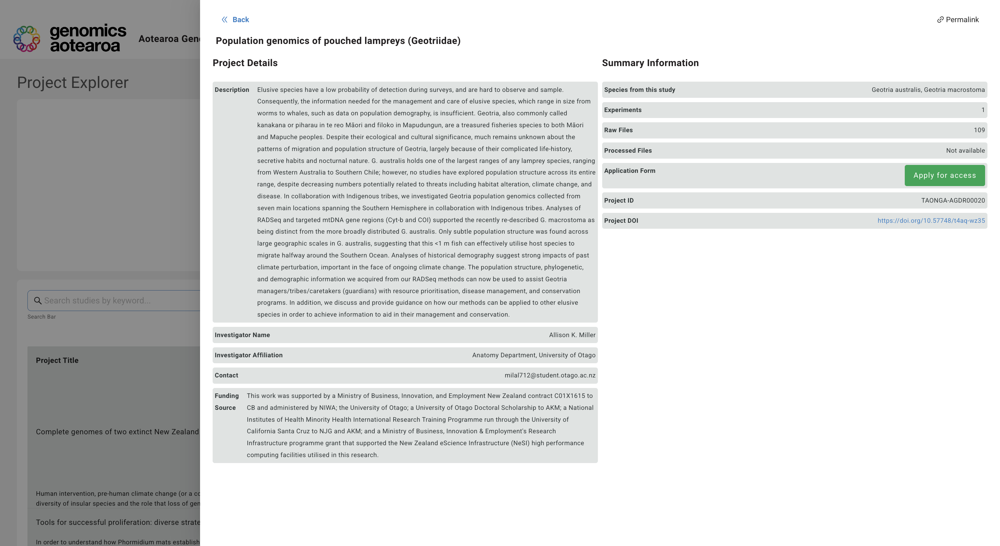

The Aotearoa Genomic Data Repository landing page is available at [https://data.agdr.org.nz/](https://data.agdr.org.nz/)

## Authentication is not required

Any user can browse the Aotearoa Genomic Data Repository, and project metadata is visible to all users. However, to access the data, you will need to apply for access.

## Discovering Projects

The data in the repository can be searched via the projects page and browsed via the Exploration page.

The project explorer -  "Projects" tab on the top menu, allows you to search by keyword, such as species, author, project code etc. You can also filter using the tags at the top of the page.

The Exploration page - “Exploration” tab in the top menu, allows you to filter at the experiment level by various aspects such as geography and species. You can also filter based on "publications" and the “Files” in the top navigation bar can be used to explore data at a file level.

By selecting any filter element, such as a project ID, other filters and total count of related species and projects are updated dynamically.

Clicking on the ‘Files’ tab enables exploration of uploaded files based on project ID, data types, and data format.

Scroll down to see the list of files.

Clicking on the project ID of a file will display more information about the associated project.

Please note although file metadata is shown, the data files are not available for download without completing the application process. Please click on the "Apply for access" link to do this.  

## Project View

From all the discovery and exploration pages project IDs can be clicked to see more information around the associated project.

The project view shows the name of the project, a brief description, and the Investigator information, file numbers and type, as well as a project DOI.

## Data Dictionary

The Data Dictionary Viewer - "Metadata Dictionary" in the top menu, is designed to make it easier to understand the data model, the field types associated with each node, and the potential values associated with each field. It displays available fields in a node and the dependencies a given node has to the existence of a prior node.

- View the Data Dictionary as a graph to see each node, its properties, and its relationships.
Relationships between nodes are represented by arrows from one node to another.

- View the Data Dictionary as a table to see the name and a brief description of each node, organised by node category. Click on the name of a node to display more information about its properties.

The metadata dictionary is under review and we would appreciate feedback.
