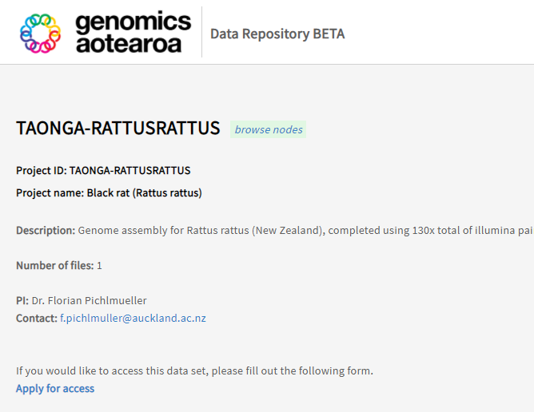
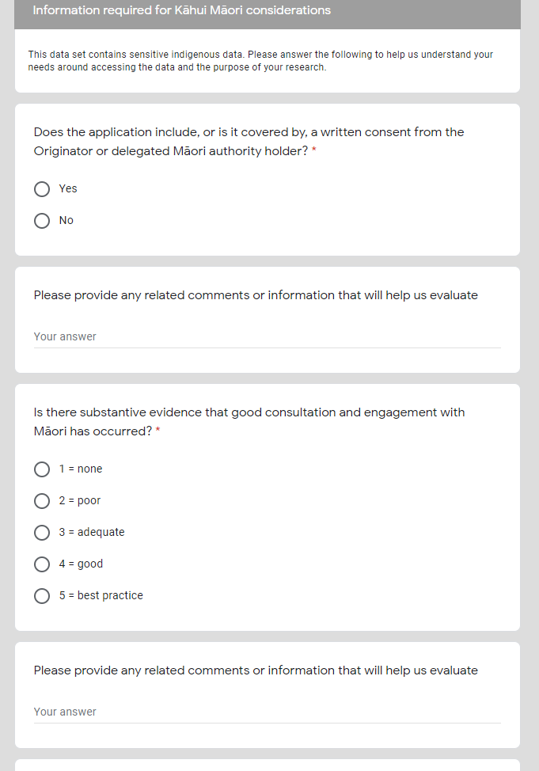
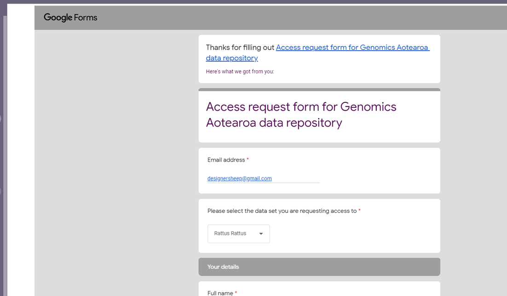

You may find access to the forms from project description pages. Direct links provided below:

- Phormidium project page: [https://data.agdr.org.nz/discovery/TAONGA-AGDR00006](https://data.agdr.org.nz/discovery/TAONGA-AGDR00006){:target="_blank"}

- Rattus-rattus project page: [https://data.agdr.org.nz/discovery/TAONGA-RATTUSRATTUS](https://data.agdr.org.nz/discovery/TAONGA-RATTUSRATTUS){:target="_blank"}

The button to Apply for access is at the bottom links to the access request form, which is located at: [https://docs.google.com/forms/u/1/d/e/1FAIpQLScerXN4MLIAgnLfrHbvheMwtM6gtDNaluZ3c_-xEiot2hc6DA/viewform](https://docs.google.com/forms/u/1/d/e/1FAIpQLScerXN4MLIAgnLfrHbvheMwtM6gtDNaluZ3c_-xEiot2hc6DA/viewform)

The form is designed with Google Forms and starts by asking which dataset you are requesting access to (this field is pre-populated if clicked from the project page), followed by a set of questions that will help with Kāhui Māori considerations, and then with the your research project details.

After submitting the form, you will receive an e-mail confirmation. Please answer as much as you can, but if you need assistance with some of the answers, feel free to contact us at [gasupport@nesi.org.nz](mailto:gasupport@nesi.org.nz)

Once the form is submitted, NeSI’s support team is notified of a new request and a ticket is created. The request will be reviewed by the AGDR team and passed on to the appropriate kaitiaki. After approval access will be granted to the data, alternatively we will reach out for more information in order to support your application and move towards approval. This process usually takes about 1 month, but feel free to reach out to [gasupport@gmail.com](mailtogasupport@gmail.com) if you have any concerns.
