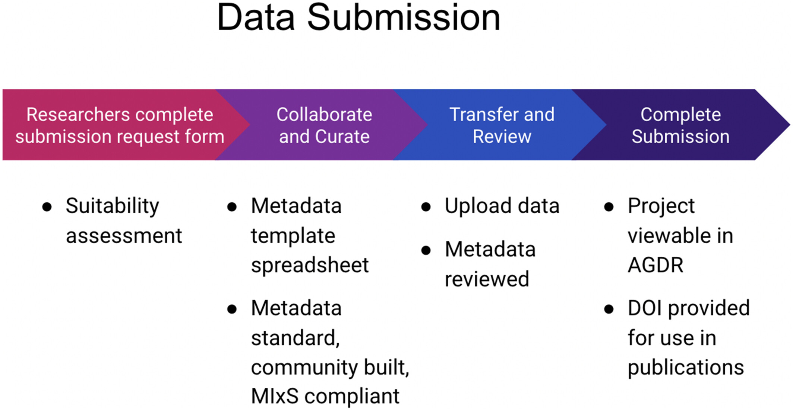

This is a user guide for the Aotearoa Genomic Data Repository. This guide focuses on how to provide metadata and data so that they can be added to the repository as a dataset.

The Aotearoa Genomic Data Repository provides secure within-nation storage, management and sharing of non-human genomic data generated from biological and environmental samples originating in Aotearoa New Zealand. This resource has been developed to follow the principles of Māori Data Sovereignty, and to enable kaitiakitanga (guardianship), so that iwi, hapū and whānau (tribes, kinship groups and families) can effectively exercise their responsibilities as guardians over biological entities that are taonga (precious or treasured). While the repository is designed to facilitate the sharing of data — making it findable by researchers and interoperable with data held in other genomic repositories — the decision-making process regarding who can access the data is entirely in the hands of those holding kaitiakitanga over each data set.

More information about the design and operating principles of the Aotearoa Genomic Data Repository can be found in our publication: [doi.org/10.1111/1755-0998.13866](https://doi.org/10.1111/1755-0998.13866).

## Workflow

1. Fill out the application form - [Application form for submitting data](https://docs.google.com/forms/d/e/1FAIpQLSfiIehUu8uSjf7hRbd1fFXHwGJ_x0J_a03yukM-SHBYkGK9dg/viewform) (If this isn't suitable for your dataset, please reach out to [gasupport@nesi.org.nz](mailto:gasupport@nesi.org.nz) and we will be happy to discuss it with you)
2. After review of your application form we will provide you with a metadata template spreadsheet to complete and instructions to transfer your data via Globus.
3. Please return the completed spreadsheet so we can proceed with your submission.
4. We validate your metadata and ingest it into AGDR on your behalf, we will then provide you with a URL to review your dataset and we can make changes as requested. We will also provide you with a DOI that can be used for publication etc.

## Metadata Template spreadsheet

The metadata Template spreadsheet is available as a [google sheet](https://docs.google.com/spreadsheets/d/1be8T4JalxRopM7pVFzTuempBGlqqhMQ_8MryGsjHI5E/edit#gid=188280636). Please make a copy and rename it relevant to your dataset before entering metadata into it. (You will be provided with this in step 2)

Once you have made a copy of this document, please fill in all the fields as much as you can under 'Your input'. Please note that there are multiple tabs which you can access via the buttons at the bottom.
The required fields are highlighted in green, though we recommend you provide as much metadata as possible. This spreadsheet is based on the [AGDR data dictionary](https://data.agdr.org.nz/DD) although some of the more obscure fields are not included in the template. If you have additional metadata, please let us know and we will see how best we can accommodate it.
If you have any questions throughout the process, please feel free to reach out to [gasupport@nesi.org.nz](gasupport@nesi.org.nz).
